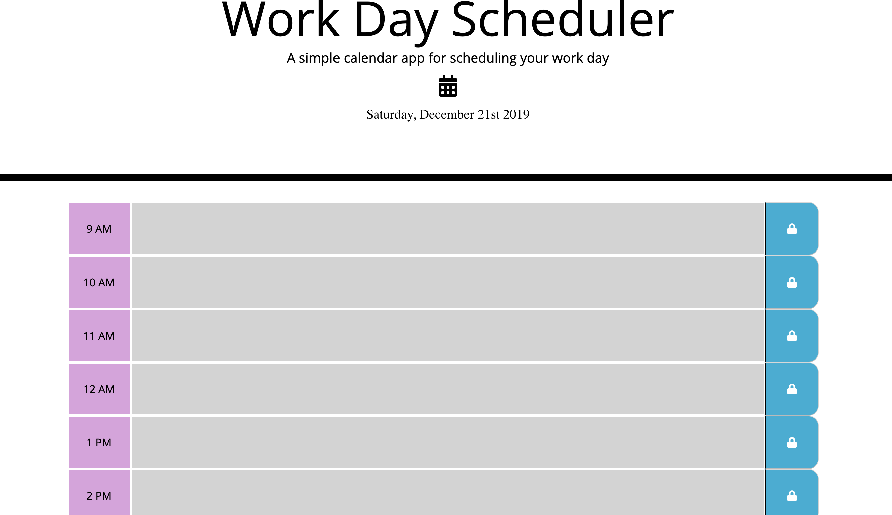

# Tyler's Daily Planner

This is a application that will help the user plan out their day for the current day from 9am to 5pm. Using moment.js javscript library the current date will be displayed in the header. Each hour is displayed using moment.js as well. The current hour on the schedule will display the text area in the color red while the future hours will be green. If the hour is in the past the color of the text area will be gray. The user can click on the button to the right which has a 'lock' icon to save the task in local storage. When the user refreshes their screen the tasks will still be there.

 
          

## Getting Started

These instructions will get you a started with how to build a multiple choice quiz game.

### Prerequisites

```
Text editor of your choosing, internet connection
```

## Built With
```
* HTML
* CSS
* Javascript
* Bootstrap framework
* JQuery
* Moment.js library

```

## Links to Wesbsite 

- https://mr-tyler31.github.io/Tylers-Daily-Planner/


## Resources

- https://developer.mozilla.org/en-US/docs/Web/JavaScript
- https://www.w3schools.com/
- https://getbootstrap.com/docs/4.3/getting-started/introduction/
- https://stackoverflow.com/
- https://momentjs.com/docs/

